# kissbacktest

Keep it simple and stupid backstesting trading strategies.

Soit le cour d'un actif (ic BTC au 15/03/2023 - périodes de 4h):

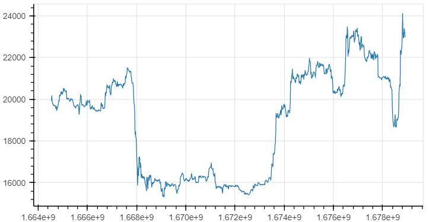

Dans l'interval $[t_{n-1}, t_n]$ le rendement vaut:

$$r_0([t_{n-1},t_n]) = { Price(t_n)\over Price(t_{n-1}) }$$

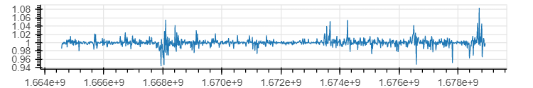

Cette définition du rendement est une simplification qui, dans le cadre du développement qui suit, est parfaitement satisfaisante. Petite particularité, le rendement neutre n'est pas 0, le neutre est 1: $Price(t_n) = Price(t_{n-1}) \rightarrow r_0 = 1$.

Signaux et position:

La stratégie consiste à déterminer selon certains critères établis préalablement, les instants $t_n$ pendant lesquels le marché est favorable à l’achat ($SIG_{achat}(t_n) = 1$) ou à la vente ($SIG_{vente}(t_n) = 1$). Entre le $1^{er}$ signal d’achat et le $1^{er}$ signal de vente suivant, on est en position ($POS(t_n) = 1$).

Stratégie basée sur le $RSI_7$:

$$\begin{cases}SIG_{achat} \equiv RSI_7 > 70 \\\\ SIG_{vente} \equiv RSI_7 < 30 \end{cases}$$

$RSI_7$:

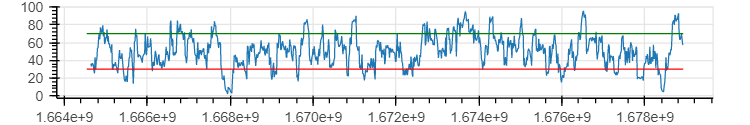

$SIG_{achat}$:

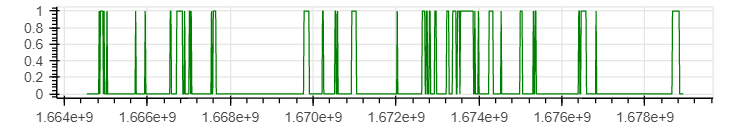

$SIG_{vente}$:

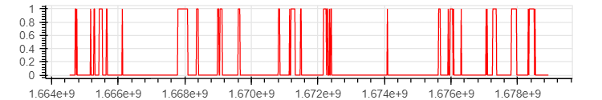

Position:

$$POS(t_n) = \begin{cases} 1 & \text{if } SIG_{achat}(t_n) = 1 \\\\ 0 & \text{if } SIG_{vente}(t_n) = 1 \\\\ POS(t_{n-1}) & \text{else} \end{cases}$$

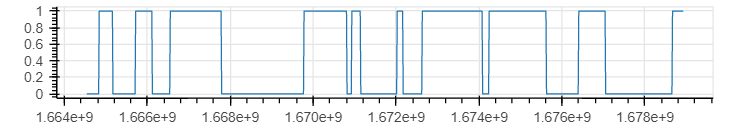

Si, sur le papier, cette proposition est séduisante par sa simlicité, l’implémentation demande une étape intermédiaire:

$$SIG_0(t_n) = SIG_{achat}(t_n) - SIG_{vente}(t_n)$$

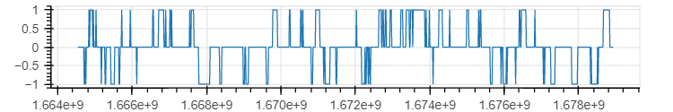

$$SIG_1(t_n) = \begin{cases} SIG_0(t_n) & \text{if } SIG_0(t_n) \ne 0 \\\\ SIG_0(t_{n-1}) & \text{else} \end{cases}$$

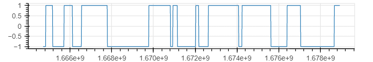

$$POS \equiv SIG_1 > 0$$

Orders:

$$ORDER_{buy}(t_n) \equiv \left( POS(t_{n-1}) = 0 \right) \space \\& \space \left( POS(t_n) = 1 \right)$$

$$ORDER_{sell}(t_n) \equiv \left( POS(t_{n-1}) = 1 \right) \space \\& \space \left( POS(t_n) = 0 \right)$$

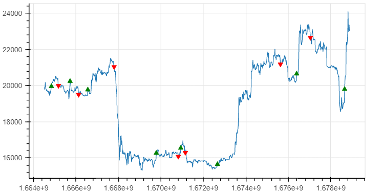

Rendement:

Interprétation du signal $POS$:

$$\begin{array}{cc|c} POS(t_{n-1}) & POS(t_n) & r_{strat}([t_{n-1},t_n]) \\\\ \hline 0 & 0 & 1 \\\\ 0 & 1 & 1 \\\\ 1 & 1 & r_0([t_{n-1},t_n]) \\\\ 1 & 0 & r_0([t_{n-1},t_n]) \\\\ \end{array}$$

Rendement de la stratégie:

$$r_{strat}(t_n) = \begin{cases} r_0(t_n) & \text{if } POS(t_{n-1}) = 1 \\\\ 1 & \text{else} \end{cases}$$

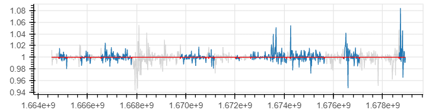

Sans oublier les fees: Lors de chaque transaction (achat et vente), la plateforme prend un fee équivalent à $fee%$:

Même raisonnement que plus haut:

$$r_{fee}(t_n) = \begin{cases} 1-fee & \text{if } POS(t_{n-1}) + POS(t_n) = 1 \\\\ 1 & \text{else} \end{cases}$$

Rendement cumulé:

$$R(t_n) = \prod_{i=1}^{t_n} \biggl( r_{strat}(i) \times r_{fee}(i) \biggr)$$

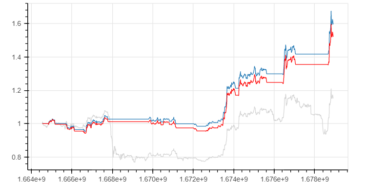

