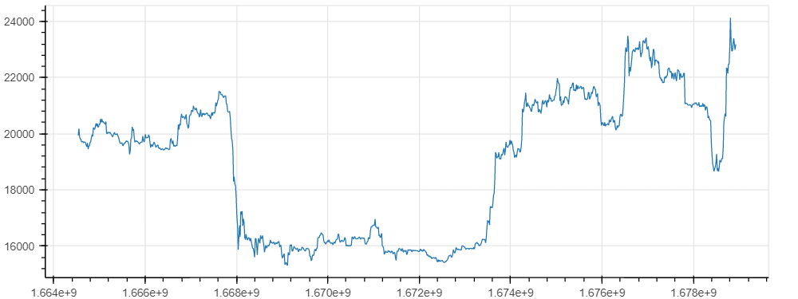

# kissbacktest

Soit le cours d'un actif (ici BTC au 13/03/2023 - périodes de 4h) :

Dans l'interval $[t_{n-1},t_n]$, le rendement vaut : 

$$ r_0([t_{n-1},t_n]) = { Prix(t_n)\over Prix(t_{n-1}) } $$

Cette définition du rendement n'est très orthodoxe. Elle en est une simplification qui, dans le cadre du développement qui suit, est parfaitement satisfaisante. Petite particularité: ici le rendement neutre n'est pas 0, le neutre est 1. $ Prix(t_n) = Prix(t_{n-1}) \rightarrow r_0 = 1 $

## Signaux et positions

La stratégie consiste à déterminer selon certains critères établis préalablement, les instants $t_n$ pendant lesquels le marché est favorable à l'achat ($SIG_{achat}(t_n) = 1$) et/ou à la vente ($SIG_{vente}(t_n) = 1$). Entre le $1^{er}$ signal d'achat et le $1^{er}$ signal de vente suivant, on est en position ($POS = 1$).
