# Backtest

Keep it simple and stupid backstesting trading strategies.

## Disclamer

_Quod de futuris non est determinata omnino veritas._

## Download data

Soit le cour d'un actif (ici BTC au 29/05/2023 - périodes de 2h):

```python
              time     open     high      low    close      volume         count
0     1.664438e+09  20119.9  20119.9  19968.2  20053.4  138.364192  2.771255e+06
1     1.664446e+09  20053.5  20127.8  20002.1  20097.5   86.577967  1.737841e+06
2     1.664453e+09  20103.6  20111.4  19956.9  20010.3  169.203402  3.390640e+06
3     1.664460e+09  20022.2  20028.8  19453.0  19503.0  317.729294  6.274010e+06
4     1.664467e+09  19501.3  19802.1  19386.0  19746.2  230.254841  4.505230e+06
...            ...      ...      ...      ...      ...         ...           ...
2896  1.685290e+09  25296.0  25296.0  25295.9  25296.0    0.012348  3.123668e+02
2897  1.685297e+09  25381.0  25500.0  25344.7  25454.5   49.642965  1.261837e+06
2898  1.685304e+09  25457.0  25457.0  25429.8  25429.8    1.014275  2.579427e+04
2899  1.685311e+09  25629.5  26000.0  25629.5  25942.3   95.758923  2.472821e+06
2900  1.685318e+09  25942.3  25994.5  25942.3  25982.3    0.775963  2.015425e+04

[2901 rows x 7 columns]
```

<p align="center">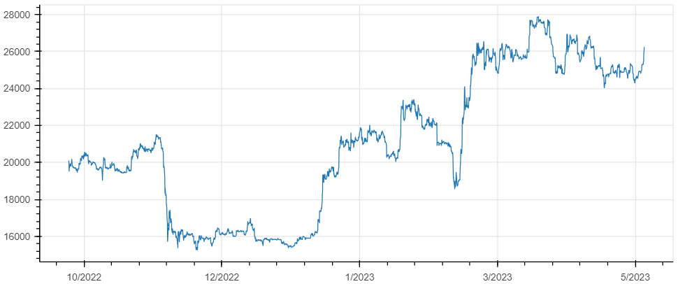</p>

## Rendement

Rendement en HODL:

$$r_0(t_n) = r_0([t_{n-1}, t_n]) = \ln \left( { Price(t_n)\over Price(t_{n-1}) } \right)$$

<p align="center">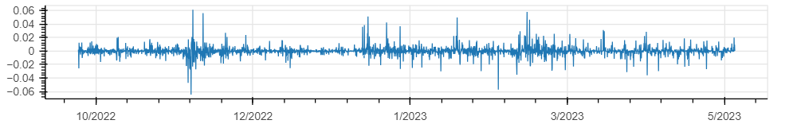</p>

## Stratégie

Position (définie par la stratégie):

$$POS(t_n) = \begin{cases} 1 & \text{position ouverte} \\\\ 0 & \text{position fermé} \end{cases}$$

Rendement brut de la stratégie:

$$r_{strat}(t_n) = r_0(t_n) \times POS(t_{n-1})$$

Fees (sur achat et vente):

$$r_{fee}(t_n) = \begin{cases} fee & \text{if } POS(t_{n-1}) \ne POS(t_n) \\\\ 0 & \text{else} \end{cases}$$

Rendement net de la stratégie:

$$r_{net}(t_n) = r_{strat}(t_n) - r_{fee}(t_n)$$

Rendement cumulé:

$$R_{net}(t_n) = \sum_{i=1}^{t_n} \biggl( r_{net}(i) \biggr)$$

### Deathcross

$$ POS(t_n) \equiv EMA_{20}(t_n) > SMA_{200}(t_n) $$

<p align="center">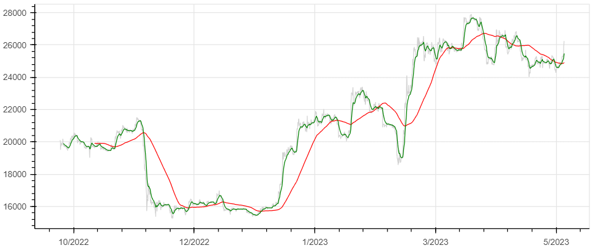</p>
<p align="center">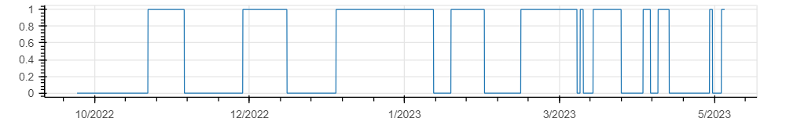</p>
<p align="center">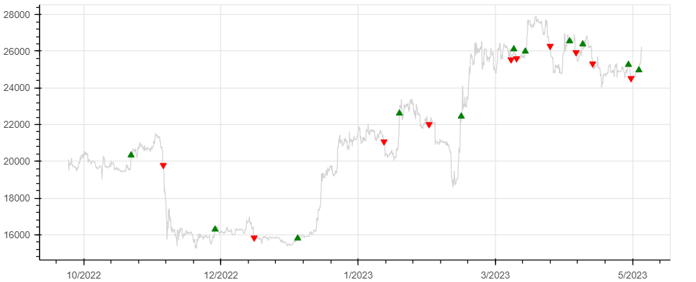</p>
<p align="center">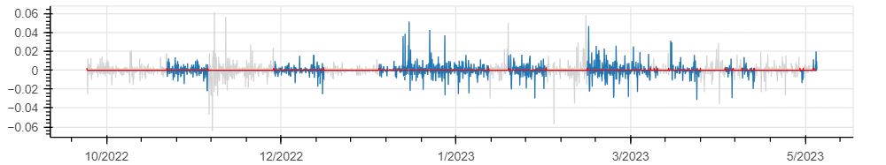</p>
<p align="center">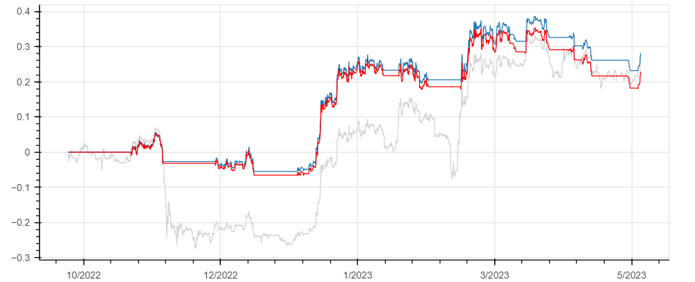</p>

Avec:

  - en grisé, le rendement cumulé en HODL
  - en bleu, le rendement brut cumulé de la stratégie
  - en rouge, le rendement net cumulé de la stratégie

### Trend following RSI

$$
\begin{align}
SIG_{buy}(t_n) &\equiv RSI_{14}(t_n) > 70 \\
SIG_{sell}(t_n) &\equiv RSI_{14}(t_n) < 30
\end{align}
$$

<p align="center">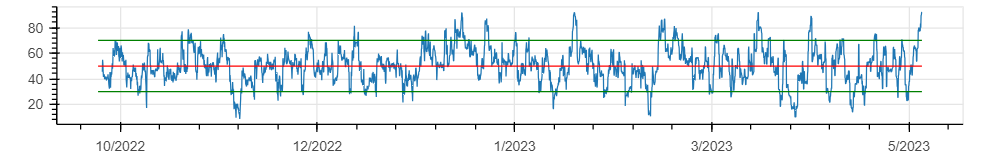</p>
<p align="center">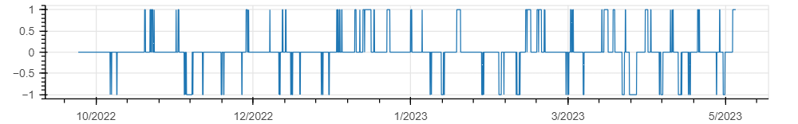</p>
<p align="center">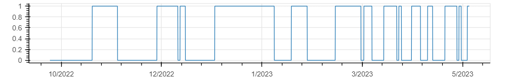</p>
<p align="center">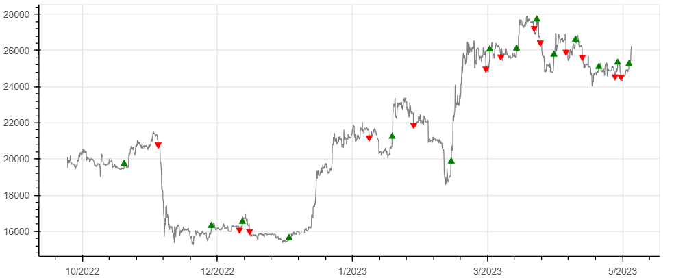</p>
<p align="center">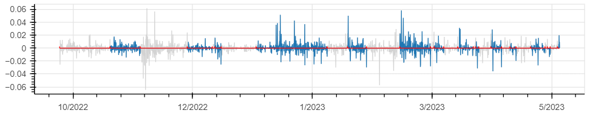</p>
<p align="center">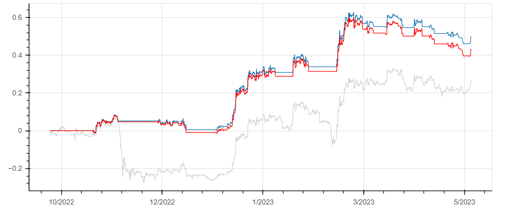</p>

### Advanced Trend following (RSI)

$$
begin{align}
SIG_{buy}^{long} &\equiv RSI_{14} > 80 \\
SIG_{sell}^{long} &\equiv RSI_{14} < 50 \\
SIG_{sell}^{short} &\equiv RSI_{14} < 20 \\
SIG_{buy}^{short} &\equiv RSI_{14} > 50
end{align}
$$

<p align="center">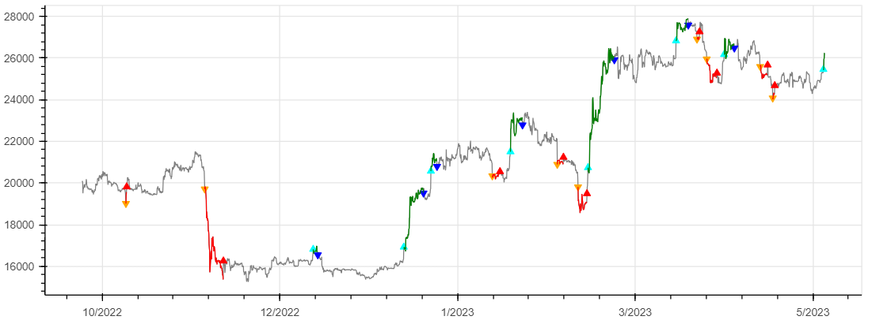</p>
<p align="center">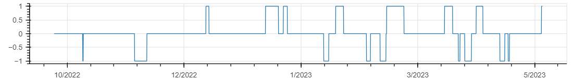</p>
<p align="center"></p>
<p align="center">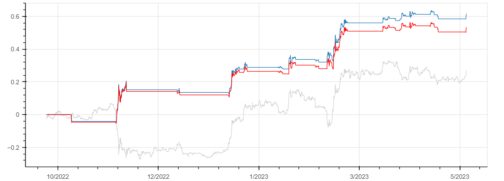</p>

<!--

### Advanced Deathcross

$$
begin{align}
POS_{long} &\equiv EMA_{15}^{close} > SMA_{50}^{high} \times 1.01 \\
POS_{short} &\equiv EMA_{15}^{close} < SMA_{50}^{low} \space / \space 1.01
and{align}
$$

<p align="center">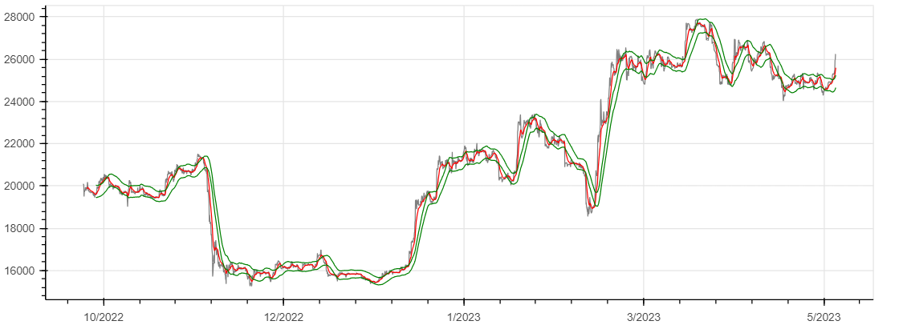</p>
<p align="center">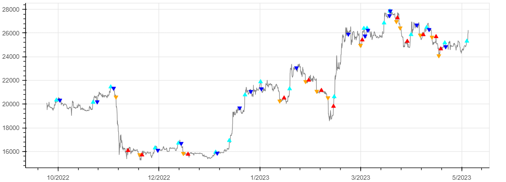</p>
<p align="center">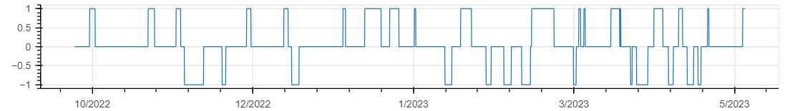</p>
<p align="center">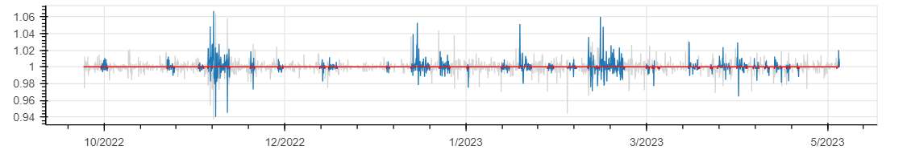</p>
<p align="center">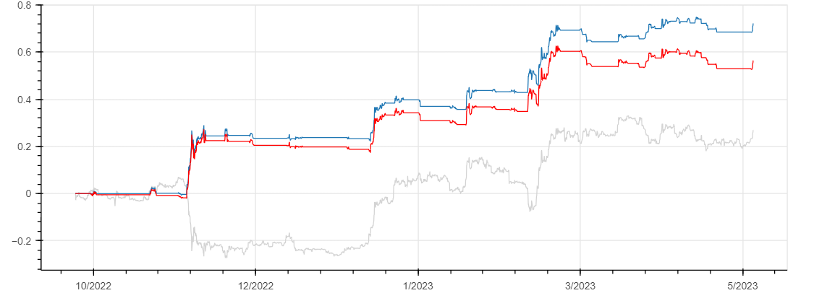</p>

-->


