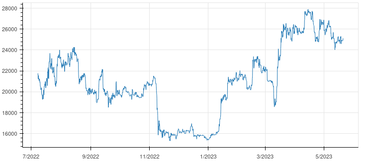
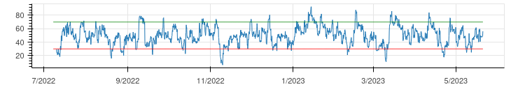
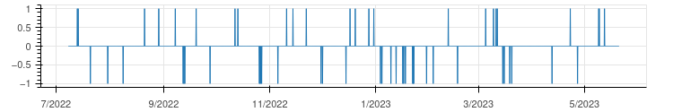
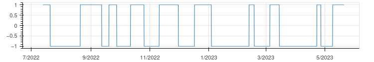
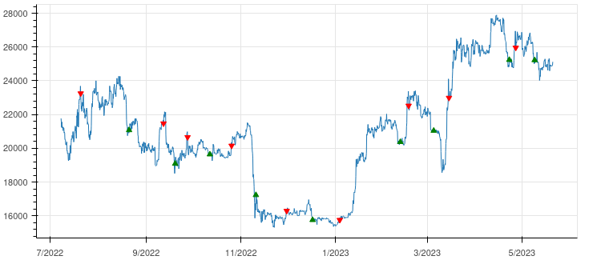
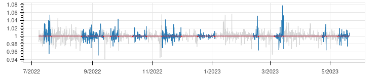
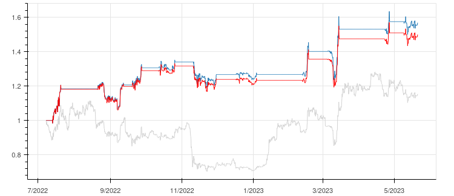

# Backtest

Keep it simple and stupid backstesting trading strategies.

## Disclamer

_Quod de futuris non est determinata omnino veritas._

## Download data

Soit le cour d'un actif (ici BTC au 20/05/2023 - périodes de 4h):

```python
                    date     open     high      low    close
0    2022-07-08 04:00:00  21264.0  22050.0  21214.8  21769.9
1    2022-07-08 08:00:00  21770.0  21919.1  21400.1  21555.3
2    2022-07-08 12:00:00  21552.7  21582.4  21075.0  21239.8
3    2022-07-08 16:00:00  21249.2  21718.2  20890.6  21567.3
4    2022-07-08 20:00:00  21567.3  21567.4  21192.7  21417.7
...                  ...      ...      ...      ...      ...
1896 2023-05-20 04:00:00  24885.0  24911.7  24838.4  24865.0
1897 2023-05-20 08:00:00  24869.8  24874.4  24854.0  24869.6
1898 2023-05-20 12:00:00  24859.5  24916.6  24856.5  24898.2
1899 2023-05-20 16:00:00  24890.0  24946.8  24882.9  24909.2
1900 2023-05-20 20:00:00  24951.2  25121.7  24919.9  25121.7

[1901 rows x 5 columns]
```

<p align="center"></p>

## Strategy

Intuitivement, un cours qui commence à remonter est un signal d'achat et un cours qui commence à redescendre est un signal de vente. Pour ça, le RSI est notre ami.

<p align="center"></p>

Signaux:

$$
\begin{align} SIG_{buy} &= \big\[ \  RSI_{14}(t_{n-1}) < 30 \  \big\]  \  \\& \  \big\[ \  RSI_{14}(t_n) > 30 \  \big\]
        \\\\ SIG_{sell} &= \big\[ \  RSI_{14}(t_{n-1}) > 70 \  \big\] \  \\& \  \big\[ \  RSI_{14}(t_n) < 70 \  \big\]
        \\\\ SIG(t_n)   &= \begin{cases} 1 & \Leftarrow  SIG_{buy} = 1
                                   \\\\ -1 & \Leftarrow  SIG_{sell} = 1
                           \end{cases}
\end{align}
$$

<p align="center"></p>

Position: 

$$POS(t_n) = \begin{cases} SIG(t_n) & \Leftarrow SIG(t_n) \neq 0 \\\\ POS(t_{n-1}) & \end{cases}$$

<p align="center"></p>


En python:

```python
SIG_buy = (RSI.shift() < 30) & (RSI > 30)
SIG_sell = (RSI.shift() > 70) & (RSI < 70)
SIG = SIG_buy.astype(int) - SIG_sell.astype(int)
POS = SIG_0.where(SIG_0 != 0).ffill()
POS_buy = df.close.where((POS == 1) & (POS.shift() == -1))
POS_sell = df.close.where((POS == -1) & (POS.shift() == 1))
```

<p align="center"></p>

## Rendement

Rendement en HODL:

$$r_0(t_n) = r_0([t_{n-1},t_n]) = { Price(t_n)\over Price(t_{n-1}) }$$

Interprétation du signal $POS$:

$$\begin{array}{cc|c} POS(t_{n-1}) & POS(t_n) & r_{strat}([t_{n-1},t_n]) \\\\ \hline -1 & -1 & 1 \\\\ -1 & 1 & 1 \\\\ 1 & 1 & r_0([t_{n-1},t_n]) \\\\ 1 & -1 & r_0([t_{n-1},t_n]) \\\\ \end{array}$$

Rendement de la stratégie:

$$r_{strat}(t_n) = r_{strat}([t_{n-1},t_n]) = \begin{cases} r_0(t_n) & \text{if } POS(t_{n-1}) = 1 \\\\ 1 & \text{else} \end{cases}$$

<p align="center"></p>

Sans oublier les fees: Lors de chaque transaction (achat et vente), la plateforme prend un fee équivalent à $fee%$:

Même raisonnement que plus haut:

$$r_{fee}(t_n) = \begin{cases} 1-fee & \text{if } POS(t_{n-1}) + POS(t_n) = 1 \\\\ 1 & \text{else} \end{cases}$$

Rendement cumulé:

$$R(t_n) = \prod_{i=1}^{t_n} \biggl( r_{strat}(i) \times r_{fee}(i) \biggr)$$

<p align="center"></p>

Avec:

  - en grisé, le rendement cumulé en HODL
  - en bleu, le rendement brut cumulé de la stratégie
  - en rouge, le rendement net cumulé de la stratégie

